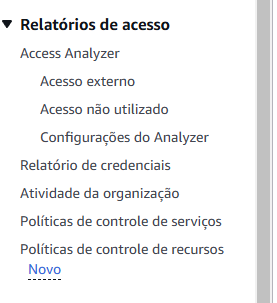

## IAM -> Identity and Access Management

Recurso responsável pelo gerenciamento de:

* Usuários e ou grupos de usuários
* Funções
* Políticas

--- 

#### Users 

* Definições para o contexto de um único usuário

#### Groups

* Definições para um grupo de usuários

#### Roles

* Definições para serviços 

---

### Reports 

There is a resource to give you a report about IAM accounts, you can access follow the steps bellow

