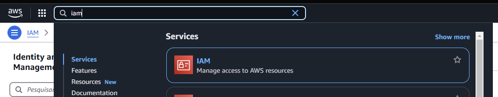
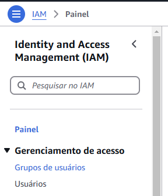
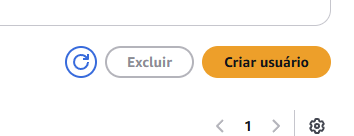

## IAM -> Creating groups 

### Go to IAM menu

First of all, you need to find IAM resource at the top menu

Then you need to click in user groups 

Now click at the right top button, to create your new user

