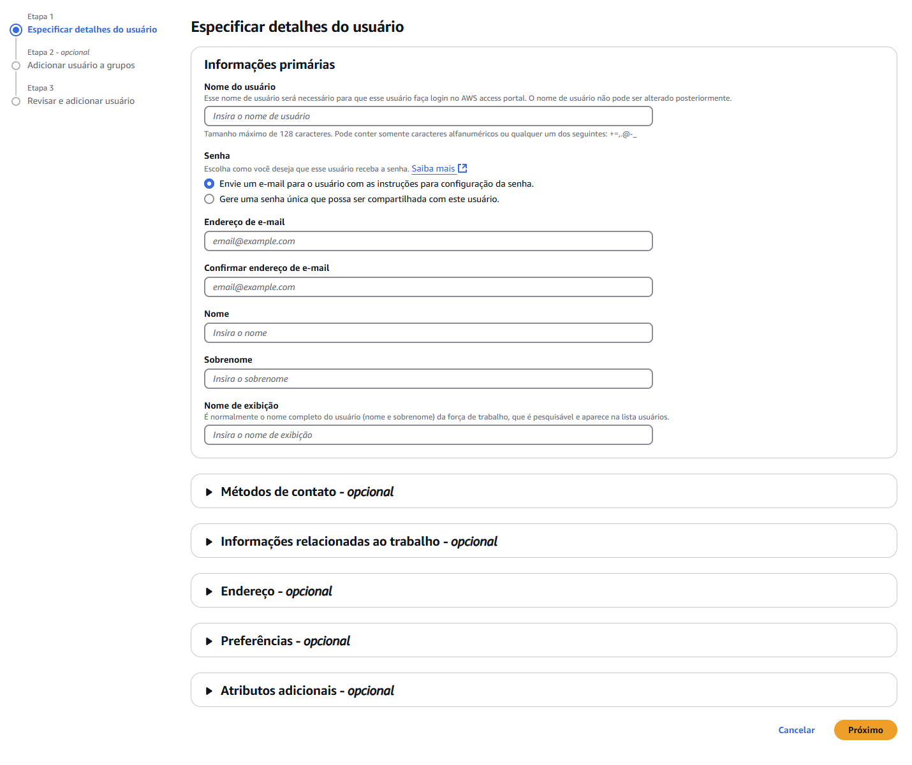

## IAM -> Organizations 

### What is? 

It's similar to SSO, you can use all IAM resources and the same login
to login in another applications, such as e-mail, for example. 

## MFA

To enable MFA, follow the basic steps. 

## IAM Identity center

What is the difference between Identity and Access Management (IAM) and IAM Identity Center?

* Manages users, groups, roles, and policies for granting access to AWS resources.
    * IAM users and roles are primarily used to interact with AWS services (e.g., EC2, S3, RDS).
    * IAM is more fine-grained, allowing resource-level permissions and service-specific access control.
    * AWS IAM Identity Center (formerly AWS SSO):

* Provides centralized user authentication and authorization for multiple AWS accounts and applications.
    * Designed for managing access to AWS accounts and third-party applications (e.g., Office 365, Salesforce).
    * Integrates with external identity providers (IdPs) like Microsoft Entra ID (Azure AD), Okta, and Google Workspace.
    * Users do not directly interact with AWS resources like IAM users but instead use federated access via Identity Center.

---

