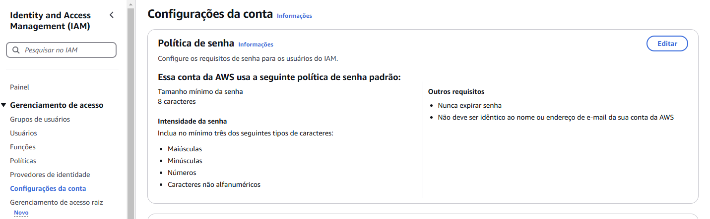
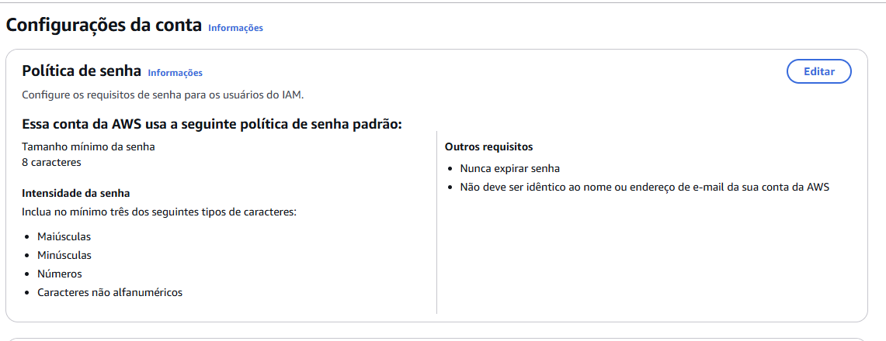

## Passwords

To managa password policies, you need to access IAM menu and go sub-menu account-configuration.

Then you will be able to edit password policies click in edit at the right top button

There is some default attributes:

* Min 8 chars
* Password never expire
* and others

